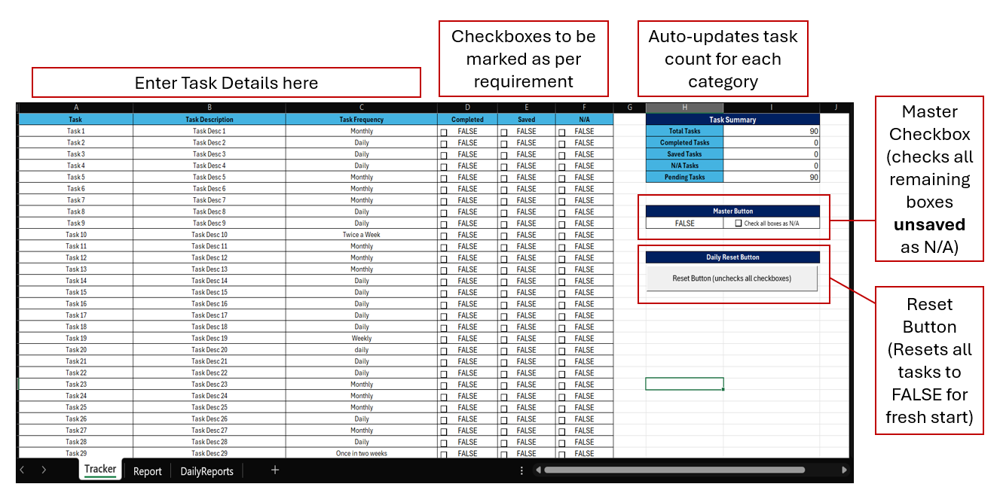
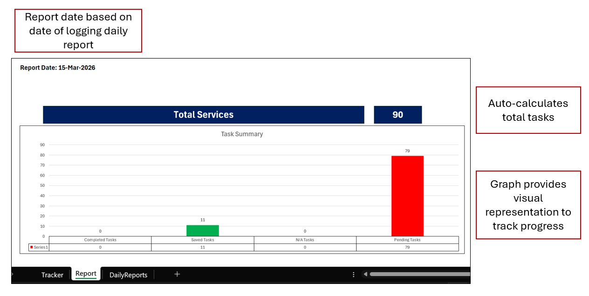
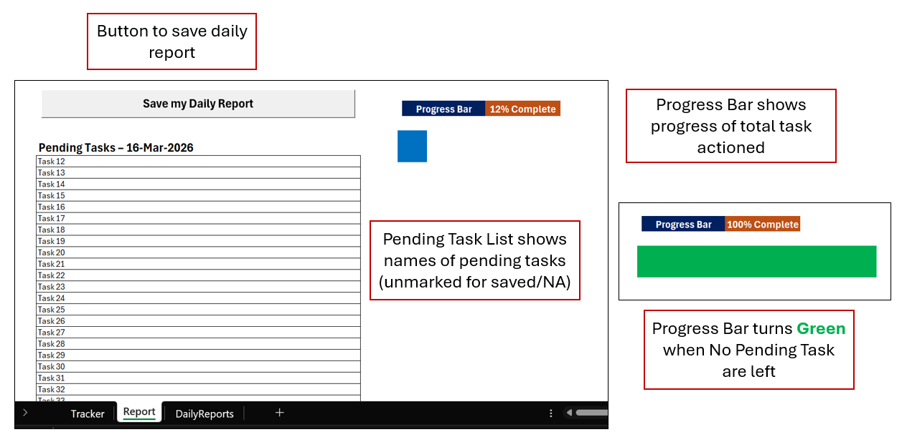
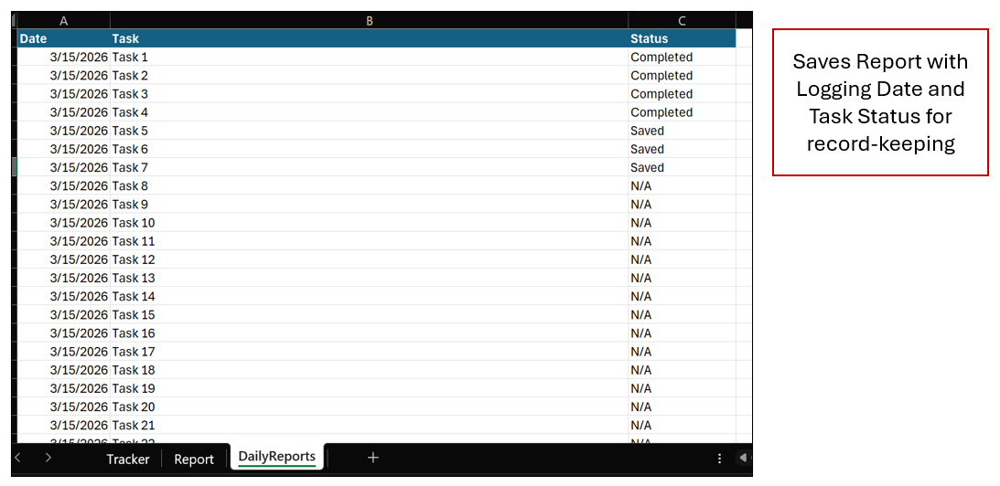

# Personal Task Tracker

An Excel-based task tracker powered by VBA automation.  
This project helps manage tasks efficiently with checkboxes, progress tracking, automated reporting, and logging daily tasks into a dedicated sheet.
The Personal Task Tracker file consists of three sheets:
- **Tracker:**
Contains all the Tasks listed with Description and Frequency to perform them. Additionally it also includes "Completed", "Saved" and "NA" checkboxes for daily tracking.
- **Report:** 
Contains a simplified dashboard to show task completion progress as well as the tasks pending for the day.
- **DailyReports:** 
Contains the data on task progress from previous days saved on clicking "Save My Daily Report" button
---

## Features
- **Master Checkbox Logic:** Mark tasks as *N/A* and auto-update summaries. Present on "Tracker" sheet.
- **Pending Task List:** Automatically lists tasks that are still pending. Present on "Report" sheet.
- **Progress Bar Visualization:** See completion progress at a glance. Present on "Report" sheet.
- **Summary Counts:** Track Completed, Saved, N/A, and Pending tasks. Present on "Tracker" sheet.
- **Reset Button:** Clears all task selections and resets the sheet for a fresh start. Present on "Tracker" sheet.
- **Save Daily Report Button:** Logs the current day’s task status into dedicated sheet for record-keeping. Present on "Report" sheet.

---
## Images for Reference

### Tracker View

### Report View

### DailyReports View

---

## How to Use
1. Open `PersonalTaskTracker.xlsm`.
2. Enable macros when prompted.
3. Use checkboxes to update task status.
4. Use the Master Checkbox to mark all remaining tasks (unsaved tasks) as N/A to improve efficiency.
5. Click **Reset** to clear tasks or **Save Daily Report** to log progress.
6. View the **Report** sheet for pending tasks and progress.

---

## Purpose
This project demonstrates how **Excel + VBA** can be used for:
- Simple automation
- Task management
- Data analysis and visualization

---

## Project Structure

Personal Task Tracker/
│
├── PersonalTaskTracker.xlsm       # Main Excel file with VBA macros
├── README.md              # Documentation for this branch
└── screenshots/           # Images used in README

---

## Notes

- The VBA code in this project assumes that a task needs to be completed and saved remove it from list of Pending Tasks.
- The VBA code for this project was initially generated with the help of Microsoft Copilot.  
- Logic design, customization, and debugging were done manually to meet the project requirements.  
- This project also demonstrates how AI tools can accelerate development, while human oversight ensures accuracy and functionality.