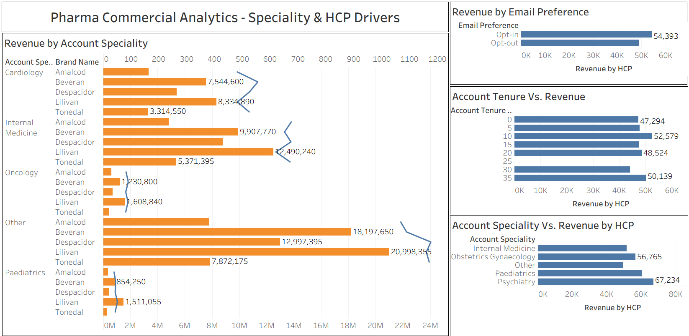

# Pharma Commercial Analytics: Specialty & HCP Value Drivers

## Overview
A commercial analytics project built on a synthetic pharma dataset (Dataiku's Omnichannel Marketing solution), 
exploring which HCP specialties, brands, and provider segments actually drive value, beyond what raw revenue 
totals show.

## Stack
SQL (Snowflake) for the data pipeline and joins, Tableau for visualization.

## What was built
- A relational data pipeline in Snowflake joining transaction, provider, and product data (~600K transaction rows)
- Four analytical views answering distinct business questions

## Key Findings

**1. Raw revenue misleads on specialty priority.**
Cardiology and "Other" lead in total revenue, largely because they have far more HCPs, not because each HCP 
is more valuable.

**2. Normalizing by HCP count flips the ranking.**
Once revenue is divided by unique HCP count, Psychiatry emerges as the highest-value specialty per doctor, 
generating over 2x the revenue-per-HCP of Cardiology, despite a fraction of the provider base.

**3. Email opt-in HCPs are just as valuable as opt-out HCPs, per doctor.**
Opt-out HCPs outnumber opt-in HCPs 23:1, so raw revenue looks lopsided. Revenue per HCP is comparable between 
the two groups, suggesting growing the opt-in base would add real value, not just volume.

**4. HCP tenure shows no meaningful relationship with revenue per HCP.**
Revenue-per-HCP stays flat (44K-52K) across tenure ranges. One sparse bucket (21-25 years, ~0 HCPs) was 
identified and excluded from interpretation rather than treated as a real data point.

## Data Limitation
This dataset doesn't include real channel/marketing exposure data (media impressions, rep visits, etc.), so 
it's scoped to what's available: transactions, provider profiles, and email consent. A production version 
would layer in real channel-level engagement data (e.g., IQVIA, Veeva) for true omnichannel attribution.

## Dashboard

## Note
This workbook uses a live Snowflake connection. Opening it without access to the same Snowflake instance 
will show the last-rendered state but won't allow live interaction. See the dashboard image above for the 
key visual output.